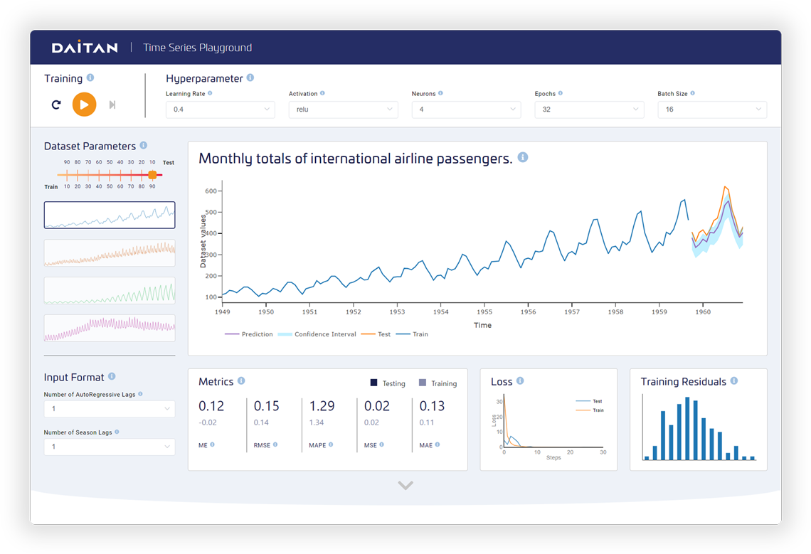

# Time Series Learning Tool

# Overview

Timeseries Learning Tool is a web app that helps the understanding of time series

# How to execute

1. Clone this repository using Git
2. Run npm install
3. Run npm run serve

# Dependencies

- Vue
- ElementUI
- Plotly.JS
- FontAwesome
- TFJS (Tensorflow)

# File structure

- **src/assets:** Contains fonts and images.
- **src/components:** Contains all Vue components, each component inside it's own folder.
- **src/constants:** Contains the definition of each metric, parameter and css variable.
- **src/models:** This folder contains elements related to the actual training and prediction, like datasets, the
  trainer itself and some utils.

# Preview

